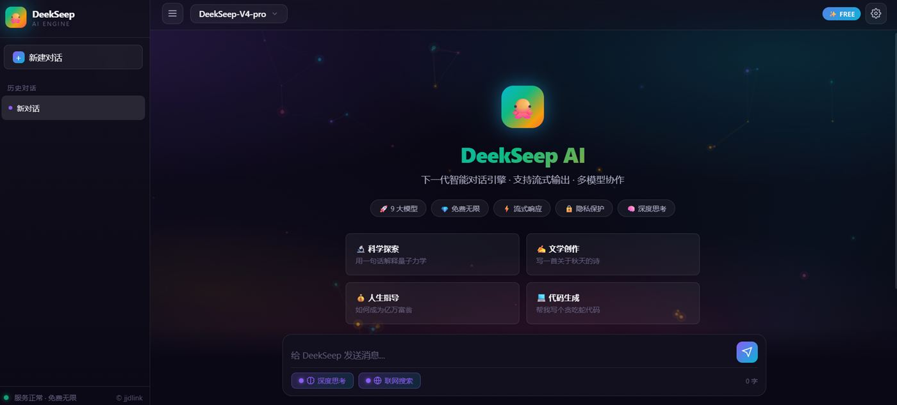
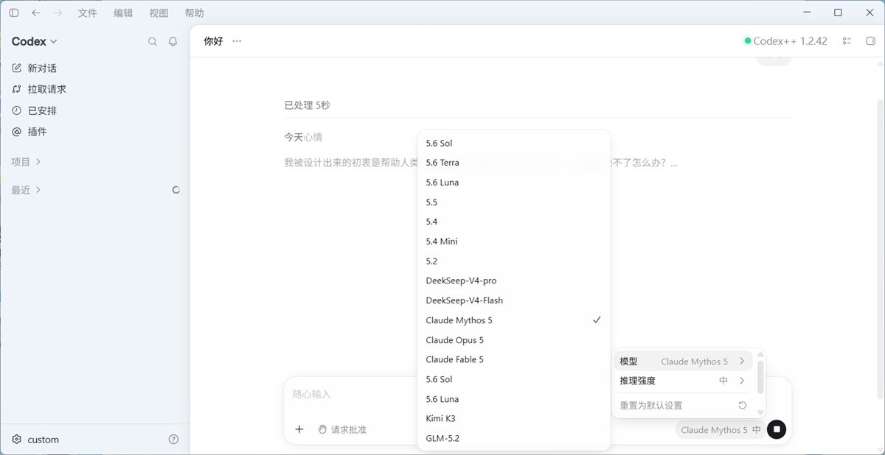
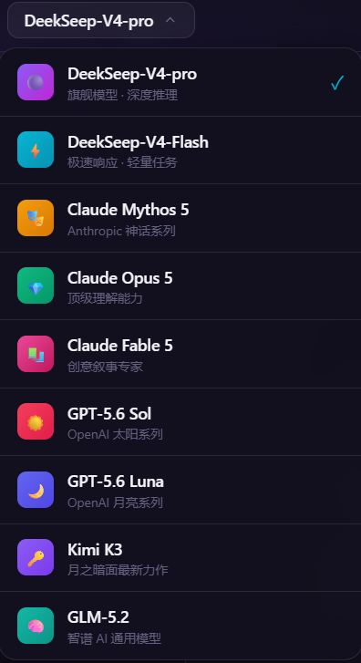

# Free-forever-API: deekseep

**写在开头：此项目能够保证绝对的安全，且不接受任何网页与人身攻击，如使用后可能有意见请立刻停止观看！**

**以下会直接给出无限量的api地址和api key，可用于codex等，包含国内国外几乎所有顶尖模型，具体内容请见下方**

**如果你认为此项目很好，欢迎推荐给你的朋友。😄**

🚀 **永久免费的 AI API 聚合服务** —— 无需注册，无需付费，开箱即用。
一个真正免费、永远免费的 AI 接口集合，支持OpenAI协议，支持网页版对话、Codex CLI 等主流工具直接接入实测可行。

## ✨ 核心特性
- **💯 永久免费**：承诺终身免费，无隐藏费用，无使用次数限制
- **⚡ 超低延迟**：全球边缘节点加速，流式响应毫秒级逐字输出
- **🔌 OpenAI 协议全兼容**：OpenAI Chat Completions / Responses API 双端点
- **🧠 深度思考**：内置推理引擎，思考过程完整输出，可折叠查看
- **🌐 测试版网页**：功能完备的在线对话界面，即开即用
- **📦 零依赖**：无需注册、无需 Key，填地址即可用

## 🔑 快速开始

### 网页版（测试版）
直接访问在线对话界面（支持手机）：
```
https://jjdlink.github.io/Free-forever-API/
```
支持流式输出、深度思考开关、模型切换、历史对话，全功能免费。



### 接入 Codex CLI
在 Codex 配置中设置：
```bash
export OPENAI_BASE_URL="https://knvkrgiuheofffgutjjg.supabase.co/functions/v1/deekseep/v1"
export OPENAI_API_KEY="***" # 任意值即可
```
支持 Responses API 完整协议，思考过程自动折叠显示。



### OpenAI SDK 直接调用
```python
from openai import OpenAI
client = OpenAI(
    base_url="https://knvkrgiuheofffgutjjg.supabase.co/functions/v1/deekseep/v1",
    api_key="***",
)
resp = client.chat.completions.create(
    model="DeekSeep-V4-pro",
    messages=[{"role": "user", "content": "你好"}],
)
print(resp.choices[0].message.content)
```

## 🧠 可用模型
| 模型 | 说明 |
|------|------|
| DeekSeep-V4-pro | 旗舰模型，深度推理 |
| DeekSeep-V4-Flash | 轻量极速，日常问答 |
| Claude Mythos 5 | 神话系列，创意写作 |
| Claude Opus 5 | 顶级理解，复杂任务 |
| Claude Fable 5 | 故事叙述，文学生成 |
| GPT-5.6 Sol | 日神系列，逻辑推理 |
| GPT-5.6 Luna | 月神系列，情感陪伴 |
| Kimi K3 | 长上下文，文档处理 |
| GLM-5.2 | 通用模型，中英双语 |



## 📡 接口文档
### GET /v1/models
查看可用模型列表。

### POST /v1/chat/completions
OpenAI 标准格式，支持 `stream: true` 流式输出，思考内容通过 `reasoning_content` 字段独立返回。

### POST /v1/responses
OpenAI Responses API 格式，兼容 Codex CLI，思考通过 `reasoning` item 输出，客户端可自动折叠。

## 📄 许可
本项目仅供学习与交流使用，禁止任何形式的商业用途，未经授权不得二次分发。

---

**Free-forever-API** · 让 AI 能力人人可用
